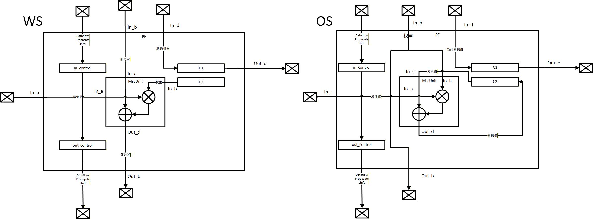

# PE.scala 精读笔记

> 文件路径：`src/main/scala/gemmini/PE.scala`
> PE（Processing Element）是脉动阵列的**最小计算单元**，也是 RSNCPU 项目中每个 PE 直接改造的基础。

---


## 1. 文件概览

PE.scala 定义了三个类：

| 类名 | 作用 | 继承 |
|------|------|------|
| `PEControl` | PE 的控制信号束（3 根控制线打包） | `Bundle` |
| `MacUnit` | 乘累加单元（纯组合逻辑） | `Module` |
| `PE` | 完整的处理元素（含寄存器和数据流控制） | `Module` |

---

## 2. `PEControl` —— 控制信号束

```scala
class PEControl[T <: Data : Arithmetic](accType: T) extends Bundle {
  val dataflow  = UInt(1.W)                       // 0=OS(输出固定), 1=WS(权重固定)
  val propagate = UInt(1.W)                       // 0=COMPUTE(计算), 1=PROPAGATE(传播)
  val shift     = UInt(log2Up(accType.getWidth).W) // 右移量（用于量化缩放）
}
```

### 语法逐行拆解

| 语法片段 | 含义 |
|---------|------|
| `class PEControl` | 定义一个类 |
| `[T <: Data]` | 泛型参数，`T` 必须是 Chisel `Data` 的子类（如 `SInt`, `UInt`, `Float`） |
| `: Arithmetic` | 上下文界定（Context Bound），是 `(implicit ev: Arithmetic[T])` 的语法糖，要求 T 必须支持算术运算 |
| `(accType: T)` | 构造参数，用于确定 `shift` 信号的位宽 |
| `extends Bundle` | 继承 Chisel 的 `Bundle`，表示这是一个信号束（类似 SystemVerilog 的 `struct`） |

### 三个字段的含义

- **`dataflow`**（1-bit）：选择数据流模式。`0` = Output Stationary，`1` = Weight Stationary
- **`propagate`**（1-bit）：控制 c1/c2 双缓冲的角色切换。`0` = 该寄存器参与计算，`1` = 该寄存器的值向外传播
- **`shift`**（`log2Up(accType.getWidth)` bit）：右移量。`accType = SInt(32.W)` 时，`log2Up(32) = 5`，即 5-bit 信号表示 0~31 的移位量。**用途**：矩阵乘法完成后，INT32 累加结果右移做量化缩放 → INT8 输出

---

### Q&A：为什么 PE 中有两个 PEControl 实例（in_control 和 out_control）？

```scala
val in_control  = Input(new PEControl(accType))
val out_control = Output(new PEControl(accType))
```

这不是"两个类"，而是**同一个 `PEControl` 类的两个实例**——一个输入、一个输出。

**原因：控制信号的脉动传递**。在脉动阵列中，控制信号和数据一样需要**从上到下逐级传播**，每个 PE 从上方邻居接收 → 自己使用 → 原样转发给下方邻居：

```
        in_control (从上方 PE 来)
            ↓
      ┌───────────┐
      │    PE     │  ← 本 PE 读取 in_control 来决定自己的行为
      └───────────┘
            ↓
        out_control (传给下方 PE)
```

对应代码：
```scala
io.out_control.dataflow  := dataflow   // 原样转发
io.out_control.propagate := prop       // 原样转发
io.out_control.shift     := shift      // 原样转发
```

**为什么不直接广播给所有 PE？** 因为脉动阵列的核心设计原则是**只与近邻通信**。直接广播会导致巨大扇出（fan-out）、布线拥塞和时序恶化。逐级传递让每根线只连接相邻两个 PE，布线规整。

**同样的模式也用于其他信号**：

| 输入 → 输出 | 传播方向 | 含义 |
|-------------|---------|------|
| `in_a` → `out_a` | 水平（左→右） | 激活值在同一行内传递 |
| `in_b` → `out_b` | 垂直（上→下） | 部分和/权重在同一列内传递 |
| `in_control` → `out_control` | 垂直 | 控制信号逐行传递 |
| `in_id` → `out_id` | 垂直 | 矩阵乘法 ID 标记 |
| `in_valid` → `out_valid` | 垂直 | 有效信号 |

这就是脉动阵列（systolic array）名字的由来——数据像心跳一样**有节奏地在相邻单元间脉动传递**。

---

## 3. `MacUnit` —— 乘累加单元

```scala
class MacUnit[T <: Data](inputType: T, weightType: T, cType: T, dType: T)
                        (implicit ev: Arithmetic[T]) extends Module {
  import ev._
  val io = IO(new Bundle {
    val in_a  = Input(inputType)     // 激活值（如 INT8）
    val in_b  = Input(weightType)    // 权重（如 INT8）
    val in_c  = Input(cType)         // 累加值（如 INT32）
    val out_d = Output(dType)        // 输出 = in_c + in_a × in_b
  })
  io.out_d := io.in_c.mac(io.in_a, io.in_b)
}
```

### 语法逐行拆解

| 语法片段 | 含义 |
|---------|------|
| `(inputType: T, weightType: T, cType: T, dType: T)` | 第一个参数列表：4 个类型对象，分别定义 a/b/c/d 端口的硬件类型。传入如 `SInt(8.W)` |
| `(implicit ev: Arithmetic[T])` | 第二个参数列表（柯里化）：隐式参数，编译器自动查找 `Arithmetic[T]` 实例并传入 |
| `extends Module` | 这是一个硬件模块，会生成对应的 Verilog module |
| `import ev._` | 导入 `Arithmetic[T]` 的所有方法到当前作用域，使 `.mac()` 可用 |
| `io.in_c.mac(io.in_a, io.in_b)` | 调用类型类方法，语义是 `self + a * b`，即 `in_c + in_a * in_b` |

### 数据流图

```
in_a (激活值，如 INT8)  ──┐
                          ├──→  out_d = in_c + in_a × in_b
in_b (权重，如 INT8)    ──┤
                          │
in_c (累加值，如 INT32) ──┘      (纯组合逻辑，一个周期完成)
```

**硬件含义**：一个 `乘法器 + 加法器`。对于 INT8 配置，就是 8-bit 乘法器 + 32-bit 加法器。

### 为什么要分四种类型（inputType/weightType/cType/dType）？

- **INT8 配置**：`inputType = SInt(8.W)`，`weightType = SInt(8.W)`，但 8×8 乘法的多次累加需要更宽的位宽防止溢出，所以 `cType = SInt(32.W)`
- **混合精度**：输入和权重可以是不同类型（如 INT8 输入 × INT4 权重）
- **浮点配置**：`T = Float(8, 24)`，所有类型都是浮点

同一份 `MacUnit` 代码适配 INT8、BF16、FP32 等不同精度，只需实例化时传入不同类型参数。

### RSNCPU 关联

- **PC 阶段**复用这个加法器：PC = PC + offset，令 `in_a=1, in_b=offset` 即可
- **ID 阶段**用 8-bit 乘法器 + 32-bit 加法器重构为操作码解码器
- **EX 阶段的 ALU** 也可复用加法器做算术运算

---

## 4. `PE` —— 完整的处理元素（核心）

### 4.1 端口总览

```scala
class PE[T <: Data](inputType: T, weightType: T, outputType: T, accType: T,
                    df: Dataflow.Value, max_simultaneous_matmuls: Int)
                   (implicit ev: Arithmetic[T]) extends Module {
```

PE 模块的数据端口是一个"十字路口"：

```
         in_b (从上方 PE 来)     in_d (从上方来的预载入数据)
           ↓                       ↓
in_a →  [ PE ]  → out_a        (a 水平传播到右边的 PE)
           ↓                       ↓
         out_b (传给下方 PE)     out_c (传给下方 PE)
```

| 端口 | 方向 | 含义 |
|------|------|------|
| `in_a` / `out_a` | 水平（左→右） | **激活值**在行内广播传播 |
| `in_b` / `out_b` | 垂直（上→下） | **权重或部分和**在列内流动 |
| `in_d` / `out_c` | 垂直（上→下） | **预载入数据 / 累加结果**在列内流动 |
| `in_control` / `out_control` | 垂直 | 控制信号（数据流类型、传播/计算、移位量） |
| `in_valid` / `out_valid` | 垂直 | 有效信号 |
| `in_id` / `out_id` | 垂直 | 矩阵乘法标识（支持多组并行矩阵乘法） |
| `in_last` / `out_last` | 垂直 | 最后一拍标记 |
| `bad_dataflow` | 输出 | 数据流配置错误指示 |

### 4.2 核心内部状态：c1 和 c2 寄存器

```scala
val cType = if (df == Dataflow.WS) inputType else accType

val c1 = Reg(cType)    // 寄存器 1
val c2 = Reg(cType)    // 寄存器 2
```

**这是 PE 内部仅有的两个数据寄存器**。它们是整个 PE 的"记忆"：
- `cType` 在不同数据流模式下宽度不同：WS 模式用 `inputType`（8-bit），OS 模式用 `accType`（32-bit）
- 在 DNN 模式下存储部分和或权重
- 在 RSNCPU 中将被复用为 IF 阶段的指令寄存器、其他流水线阶段的暂存等

### 4.3 MacUnit 实例化

```scala
val mac_unit = Module(new MacUnit(inputType, weightType,
  if (df == Dataflow.WS) outputType else accType, outputType))
```

注释说明了原因：当 PE 支持多种数据流时，综合工具经常无法合并重复的 MAC 单元。显式创建一个 `MacUnit` 模块迫使工具只使用一套 MAC 电路。

### 4.4 flip 与 shift_offset（双缓冲切换检测）

```scala
val last_s = RegEnable(prop, valid)      // 上一拍的 propagate 值
val flip = last_s =/= prop              // 检测 propagate 是否翻转
val shift_offset = Mux(flip, shift, 0.U) // 翻转时应用移位，否则不移位
```

`flip` 检测 c1/c2 角色是否发生切换。只有在**切换瞬间**才应用量化右移（`shift`），平时不移位。

### 4.5 权重固定模式（Weight Stationary, WS）—— Gemmini 默认

```scala
when(prop === PROPAGATE) {
  io.out_c := c1                        // c1 的值作为结果传出
  mac_unit.io.in_b := c2.asTypeOf(...)  // c2 存的权重 → 送入乘法器
  mac_unit.io.in_c := b                 // 上方来的部分和 → 累加输入
  io.out_b := mac_unit.io.out_d         // MAC 结果 = b + a*c2 → 向下传
  c1 := d                               // 新的预载入数据写入 c1
}
```

**数据流图（WS，prop=PROPAGATE）**：
```
                  in_b (上方部分和)
                    ↓
in_a (激活值) →  [ MAC: out = in_b + in_a × c2(权重) ]
                    ↓
                  out_b (部分和，向下传递)

同时: out_c = c1 (把旧数据传出)
      c1 := d    (载入新数据)
```

**含义**：权重固定在 c2 里不动，每个时钟周期 `in_a`（激活值）从左边进来，和 c2（权重）相乘，加上 `in_b`（上方部分和），结果通过 `out_b` 向下传。这就是经典的**权重固定脉动阵列**。

### 4.6 输出固定模式（Output Stationary, OS）

```scala
when(prop === PROPAGATE) {
  io.out_c := (c1 >> shift_offset).clippedToWidthOf(outputType)  // c1 累积结果右移截断后输出
  io.out_b := b                            // b 直通
  mac_unit.io.in_b := b.asTypeOf(...)      // 权重从上方来
  mac_unit.io.in_c := c2                   // c2 是正在累积的部分和
  c2 := mac_unit.io.out_d                  // MAC 结果 = c2 + a*b → 回写 c2
  c1 := d.withWidthOf(cType)               // 新累积值载入 c1
}
```

**含义**：部分和固定在 PE 内部（c2）持续累加，不向下传递。累积完成后通过 `out_c` 输出。

### 4.7 `propagate` 信号的作用——双缓冲

`c1` 和 `c2` 构成一个**双缓冲（double buffer）**：
- 当 `prop = PROPAGATE` 时：c1 输出结果，c2 参与计算
- 当 `prop = COMPUTE` 时：c2 输出结果，c1 参与计算

**重要意义**：允许在输出一组矩阵乘法结果的同时，预载入下一组权重，实现**流水线无气泡**。RSNCPU 中 DNN 模式下需要保留这个机制。

### 4.8 无效数据保护

```scala
when (!valid) {
  c1 := c1    // 保持不变（不更新，等效于时钟门控）
  c2 := c2
  mac_unit.io.in_b := DontCare
  mac_unit.io.in_c := DontCare
}
```

当 `valid = false` 时，PE 冻结状态不更新。用于处理脉动阵列的边界条件。

---

## 5. accType 的定义与传递链

### Q&A：`accType` 定义在哪个文件中？

`accType` 不是一个"类型定义"，而是一个**构造参数**，其具体值由上层逐级传入。

**最终源头**在 `Configs.scala` 第 25 行：

```scala
accType = SInt(32.W),   // ← 这里！32-bit 有符号整数
```

完整传递链：

```
GemminiConfigs.defaultConfig          ← accType = SInt(32.W)  定义在 Configs.scala
  └→ GemminiArrayConfig.accType       ← 存储在配置结构体中     GemminiConfigs.scala:22
       └→ ExecuteController           ← 读取 config.accType    ExecuteController.scala
            └→ MeshWithDelays(accType)
                 └→ Mesh(accType)
                      └→ Tile(accType)
                           └→ PE(accType)                      ← PE.scala 中使用
```

**默认 INT8 配置下的各类型**：

| 参数 | 值 | 含义 |
|------|-----|------|
| `inputType` | `SInt(8.W)` | 8-bit 有符号（激活值） |
| `weightType` | `SInt(8.W)` | 8-bit 有符号（权重） |
| `accType` | `SInt(32.W)` | 32-bit 有符号（累加器） |

`accType` 用 32-bit 是因为 INT8 × INT8 的多次乘累加会产生远超 8-bit 范围的中间和。在 PE 中，`accType` 具体影响了：
- `PEControl.shift` 的位宽：`log2Up(32) = 5`，即 5-bit
- `c1`/`c2` 寄存器在 OS 模式下的宽度：32-bit
- `MacUnit` 的累加输入 `cType` 在 OS 模式下：32-bit

---

## 6. RSNCPU 关联问题（带着问题读 RTL）

### Q1: MacUnit 的加法器和 32-bit 寄存器如何被 SNCPU 复用为 PC？

`MacUnit` 的核心操作是 `in_c + in_a * in_b`。如果令 `in_a = 1, in_b = offset`（或直接旁路乘法器），则 `out_d = in_c + offset`，这就是 `PC = PC + imm` 的操作。c1 或 c2 寄存器（32-bit）可直接作为 PC 寄存器。SNCPU 声称 PC 阶段逻辑复用率 69%，因为加法器和寄存器被完全复用。

### Q2: c1/c2 寄存器如何复用为 IF 阶段的指令寄存器？

`c1` 和 `c2` 是 `Reg(cType)` —— 对于 INT8 配置 OS 模式，`cType = accType = SInt(32.W)`，即 32-bit 宽。IF 阶段需要暂存从指令缓存取到的 32-bit RISC-V 指令字，c1/c2 完全满足此需求。CPU 模式下，c1 存放当前指令，c2 可存放下一条预取指令（保留双缓冲的流水线优势）。

### Q3: Scratchpad 的 bank 寻址机制与 AOMEM 三角色切换有何异同？

（留待 Scratchpad.scala 精读时解答）
