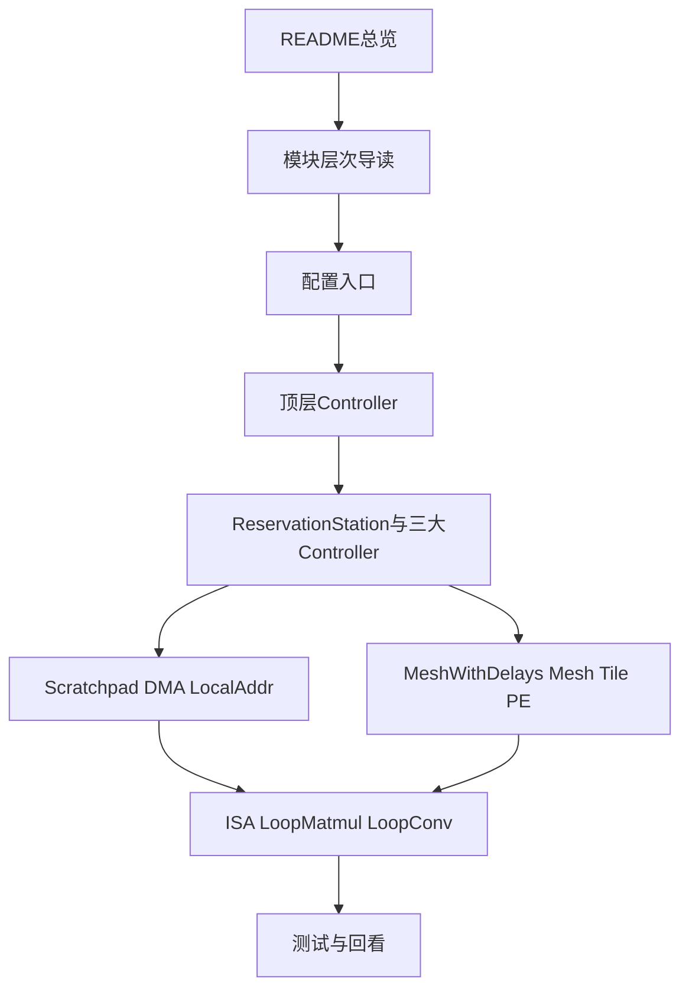

# Gemmini 硬件源码学习计划（面向零基础）

> 目标：让一个刚接触 Gemmini 的同学，用尽量短的路径建立完整源码心智模型。  
> 原则：先抓主链，再补细节；先理解模块职责，再追状态机与位域。

---

## 1. 先建立正确预期

第一次读 Gemmini，不要把目标定成“读完每个 Scala 文件”。  
正确目标应该是：

1. 知道 Gemmini 在 Chipyard 里怎么挂进去。
2. 知道命令是怎么从 CPU 走到 load / execute / store 的。
3. 知道数据怎么在主存、Scratchpad、Accumulator、阵列之间流动。
4. 知道 `Mesh -> Tile -> PE` 三层分别负责什么。
5. 知道哪些文件是第一轮必读，哪些文件第二轮再看。

如果你第一轮就陷进 `ISA` 位域、`DMA` 事务拆分细节、`LocalAddr` 位编码，很容易读到第三天就失去方向。

---

## 2. 推荐学习顺序



你可以把 Gemmini 硬件源码理解成 5 层：

1. 配置层：决定 Gemmini 长什么样。
2. 顶层装配与前端展开层：把命令接进来、拆开、送去调度。
3. 三大 controller 层：分别处理 load / store / execute。
4. 片上存储与阵列层：真正搬数据、算数据。
5. 公共基础层：地址、ISA、DMA 跟踪器、工具模块。

---

## 3. 第一轮只抓这条主链

```text
GemminiConfigs.scala / Configs.scala
    -> Controller.scala
        -> LoopMatmul.scala / LoopConv.scala
        -> ReservationStation.scala
            -> LoadController.scala
            -> StoreController.scala
            -> ExecuteController.scala
                -> Scratchpad.scala
                -> MeshWithDelays.scala
                    -> Mesh.scala
                        -> Tile.scala
                            -> PE.scala
```

同时记住一条并行访存主线：

```text
LoadController / StoreController
    -> Scratchpad.scala
        -> DMA.scala
        -> LocalAddr.scala
        -> DMACommandTracker.scala
        -> XactTracker.scala
```

第一次阅读时，你只需要能说清一句话：

**CPU 发来 Gemmini 命令后，顶层先接住命令，前端把大命令拆小，`ReservationStation` 决定谁能先发，三个 controller 分别干 load / store / execute，`Scratchpad` 和阵列负责真正搬运与计算。**

---

## 4. 10 天学习安排

## Day 0（2026-03-13）：建立最小背景

### 阅读文件

- `README.md`
- `src/shen_src_explain/shen_chisel_scala_basics.md`
- `src/shen_src_explain/shen_gemmini_module_hierarchy.md`

### 这一天只做 4 件事

1. 理解 Gemmini 是 RoCC 加速器，不是独立 CPU。
2. 理解 `decoupled access/execute` 的大意。
3. 理解 Scratchpad、Accumulator、Systolic Array 这三个词。
4. 理解 Gemmini 源码不能按字母顺序硬啃，必须按主链读。

### 读完后你要能回答

- Gemmini 在系统里大概扮演什么角色？
- 为什么它把 load / store / execute 分开？
- 为什么 `Scratchpad` 不是普通“缓存”，而是专用片上存储？

### 今天不要做

- 不要看 `ISA` 细节。
- 不要看 `LocalAddr` 位域。
- 不要试图搞懂每个 `Queue` 和 `Arbiter`。

---

## Day 1（2026-03-14）：先看配置，理解“硬件长什么样”

### 阅读文件

- `src/main/scala/gemmini/GemminiConfigs.scala`
- `src/main/scala/gemmini/Configs.scala`

### 阅读目标

先不要逐字段背参数，先抓 3 件事：

1. 哪些参数决定阵列大小、数据类型、bank 数、队列深度。
2. `GemminiArrayConfig` 为什么是参数根。
3. Gemmini 最终是如何挂到 `BuildRoCC` 里的。

### 读法建议

- 第一遍只看 case class / config 组织方式。
- 第二遍只标出“影响阵列规模”和“影响存储组织”的字段。
- 第三遍再看默认配置长什么样。

### 读完后你要能回答

- Gemmini 的“外形”主要由哪类参数决定？
- SoC 在哪里实例化 Gemmini？

---

## Day 2（2026-03-15）：先抓顶层，不要急着下钻

### 阅读文件

- `src/main/scala/gemmini/Controller.scala`

### 阅读目标

这一天的目标不是读懂全部逻辑，而是建立“顶层总装图”。

### 重点只看

1. 顶层实例化了哪些模块。
2. 原始命令从哪里进入。
3. `LoopMatmul` / `LoopConv` 在什么位置。
4. `ReservationStation` 在什么位置。
5. `LoadController` / `StoreController` / `ExecuteController` 如何接上去。

### 推荐读法

- 第一遍：只找 `val xxx = Module(...)`
- 第二遍：只看模块之间的接口接线
- 第三遍：只追一条命令从入口到三个 controller 的去向

### 读完后你要能画出

`CPU/RoCC -> Controller -> LoopMatmul/LoopConv -> ReservationStation -> Load/Store/Execute`

---

## Day 3（2026-03-16）：理解为什么需要 ReservationStation

### 阅读文件

- `src/main/scala/gemmini/ReservationStation.scala`
- `src/main/scala/gemmini/LoadController.scala`
- `src/main/scala/gemmini/StoreController.scala`
- `src/main/scala/gemmini/ExecuteController.scala`

### 阅读目标

你要理解的不是所有细节，而是：

1. 为什么 Gemmini 允许不同类型命令并行。
2. 为什么需要一个地方统一做依赖检查和发射。
3. 三个 controller 的职责边界是什么。

### 一句话记忆

- `LoadController`：把数据搬进来。
- `StoreController`：把结果搬出去。
- `ExecuteController`：在内部做计算。

### 读完后你要能回答

- 同一个 controller 内为什么默认按程序顺序收指令？
- 不同 controller 之间为什么可能并行？
- `ReservationStation` 到底在“调度什么”？

---

## Day 4（2026-03-17）：先把 Scratchpad 看成总枢纽

### 阅读文件

- `src/main/scala/gemmini/Scratchpad.scala`
- 回看 `README.md` 里的 `Scratchpad and Accumulator`

### 阅读目标

这一天只抓一个认识：

**Gemmini 的数据中心不是 `Mesh`，而是 `Scratchpad`。**

### 重点关注

1. load 路径如何把数据送进片上存储。
2. execute 路径如何从片上存储取数。
3. store 路径如何从片上存储取结果写回。
4. accumulator、scale、activation 等后处理为什么都围着它转。

### 读完后你要能回答

- 为什么说 `Scratchpad.scala` 是片上存储总枢纽？
- scratchpad 和 accumulator 的职责差异是什么？

---

## Day 5（2026-03-18）：把访存细节补上

### 阅读文件

- `src/main/scala/gemmini/DMA.scala`
- `src/main/scala/gemmini/LocalAddr.scala`
- `src/main/scala/gemmini/DMACommandTracker.scala`
- `src/main/scala/gemmini/XactTracker.scala`
- `src/shen_src_explain/shen_LocalAddr_scala_explain.md`

### 阅读目标

这一步才开始进入第一轮的细节区，但仍然不要死扣位宽公式，重点只放在：

1. 本地地址如何区分 scratchpad / accumulator。
2. DMA 为什么要把请求拆成多个事务。
3. 为什么地址对齐、事务大小会影响实现。

### 读完后你要能回答

- Gemmini 为什么不能“想读多少就一次性读多少”？
- `LocalAddr` 解决的是哪类问题？

---

## Day 6（2026-03-19）：理解阵列入口，而不是先看最小 PE

### 阅读文件

- `src/main/scala/gemmini/MeshWithDelays.scala`
- `src/main/scala/gemmini/Transposer.scala`
- 回看 `README.md` 里的 `Systolic Array and Transposer`

### 阅读目标

很多初学者一上来读 `PE.scala`，很容易迷失。  
更好的顺序是先读阵列入口，先理解：

1. 为什么阵列前要有 delay。
2. 为什么有 transposer。
3. 为什么 WS/OS 两种数据流会影响数据输入方式。

### 读完后你要能回答

- `MeshWithDelays` 比 `Mesh` 多做了什么？
- 为什么输入不能直接一股脑送进阵列？

---

## Day 7（2026-03-20）：再下钻到 Mesh / Tile / PE

### 阅读文件

- `src/main/scala/gemmini/Mesh.scala`
- `src/main/scala/gemmini/Tile.scala`
- `src/main/scala/gemmini/PE.scala`
- `src/shen_src_explain/shen_Tile_Mesh_scala_explain.md`
- `src/shen_src_explain/shen_PE_scala_explain.md`

### 阅读目标

理解 3 层职责分工：

1. `Mesh`：大阵列组织与 tile 间流水。
2. `Tile`：一组 PE 的局部组织。
3. `PE`：最小乘加单元。

### 这一天要特别避免的误区

- 不要一开始就抠每个寄存器和控制位。
- 不要把 `Tile` 和 `Mesh` 当成纯粹“容器”；它们承担了时序与组织职责。
- 不要脱离 WS/OS 数据流单独看 PE。

### 读完后你要能回答

- 为什么 Gemmini 要分成 `Mesh -> Tile -> PE` 三层？
- PE 内部哪些行为是数据流模式决定的？

---

## Day 8（2026-03-21）：最后再补 ISA 和高级指令

### 阅读文件

- `src/main/scala/gemmini/GemminiISA.scala`
- `src/main/scala/gemmini/LoopMatmul.scala`
- `src/main/scala/gemmini/LoopConv.scala`
- `src/main/scala/gemmini/Im2Col.scala`

### 阅读目标

先有整体图，再看 ISA，效率最高。  
这时你要理解的是：

1. ISA 只是软件和硬件之间的命令接口。
2. `LoopMatmul` / `LoopConv` 不是“另一个 Gemmini”，而是高级命令展开器。
3. 高级命令的价值是替软件自动做 tiling、unroll、双缓冲和重叠调度。

### 读完后你要能回答

- 为什么高层循环指令能提升易用性和性能？
- 为什么不建议在完全不懂主链前先啃 `ISA`？

---

## Day 9（2026-03-22）：把测试和源码路径连起来

### 阅读文件

- `software/gemmini-rocc-tests/README.md`
- 任意一个 baremetal 测试

### 建议做法

不要一开始跑很多测试，先挑一个最简单的例子，沿着下面这条线追：

```text
mvin -> preload/compute -> mvout
```

### 这一天的目标

把“文档里说的事”和“源码里接的线”对上。

### 读完后你要能回答

- 一个最简单的 Gemmini 工作流，软件侧长什么样？
- 它在硬件里大概走过哪些模块？

---

## Day 10（2026-03-23）：回看与输出

### 这一天不新增阅读文件

你要做的是把前 9 天的阅读结果收束成自己的心智模型。

### 至少输出 3 张图

1. 模块层次图
2. 命令流图
3. 数据流图

### 至少完成 1 次口头复述

尝试在 5 分钟内讲清下面这段话：

> Gemmini 通过 RoCC 挂到系统里，前端接收和展开命令，`ReservationStation` 检查依赖后向 load/store/execute 三条路径发射；数据通过 DMA 和片上 `Scratchpad/Accumulator` 搬运，计算由 `MeshWithDelays -> Mesh -> Tile -> PE` 阵列完成，高级指令再在这套基础上做更大的矩阵乘和卷积展开。

如果你能顺畅讲完，说明第一轮阅读已经真正建立起框架了。

---

## 5. 第一轮不要深陷的文件

下面这些文件不是不重要，而是**不适合作为第一轮入口**：

- `src/main/scala/gemmini/CmdFSM.scala`
- `src/main/scala/gemmini/TilerController.scala`
- `src/main/scala/gemmini/TilerFSM.scala`
- `src/main/scala/gemmini/TilerScheduler.scala`
- `RSNCPU/plan/shen_research_plan_2026-2027_v2.md`

第一轮先绕开它们，能显著降低认知负担。

---

## 6. 每天都用这 4 个问题自检

每读完一天，都问自己：

1. 这一层模块的系统职责是什么？
2. 它的上游是谁，下游是谁？
3. 它处理的是命令、数据，还是控制/依赖？
4. 如果删掉这一层，Gemmini 会失去什么能力？

如果这 4 个问题答不出来，就不要急着进入下一天。

---

## 7. 最适合零基础的阅读方法

### 方法 1：只看模块职责，不先看代码细枝末节

先回答“这个模块存在是为了解决什么问题”，再看它怎么写。

### 方法 2：先画框图，再抠细节

如果框图都画不出来，说明你还不该读状态机细节。

### 方法 3：一次只追一条线

不要同时追命令流、数据流、地址编码。  
一次只追一条，效率最高。

### 方法 4：反复回到 `Controller.scala`

每次迷路，都回顶层。  
顶层是你所有源码阅读的地图入口。

---

## 8. 学完第一轮后，你应该具备的能力

如果这份计划执行得比较扎实，第一轮结束后你应该能独立回答：

1. Gemmini 的顶层控制主线是什么。
2. 为什么它是 decoupled access/execute。
3. `ReservationStation` 在整体结构里解决什么问题。
4. `Scratchpad` 为什么是核心枢纽。
5. `Mesh / Tile / PE` 三层分别承担什么职责。
6. `DMA / LocalAddr / ISA / LoopMatmul / LoopConv` 各自在整体里处于什么位置。

---

## 9. 给初学者的最后建议

如果你现在还是 Gemmini 小白，请按下面这个最短路径开始：

1. 先读 `README.md` 的架构部分。
2. 再读 `src/shen_src_explain/shen_gemmini_module_hierarchy.md`。
3. 然后只抓 `Configs -> Controller -> ReservationStation -> Scratchpad -> MeshWithDelays -> Mesh -> Tile -> PE`。
4. 最后再补 `DMA / LocalAddr / ISA / LoopMatmul / LoopConv`。

这条路线不是“最全”，但对初学者来说是**最快进入状态**的一条主线。
